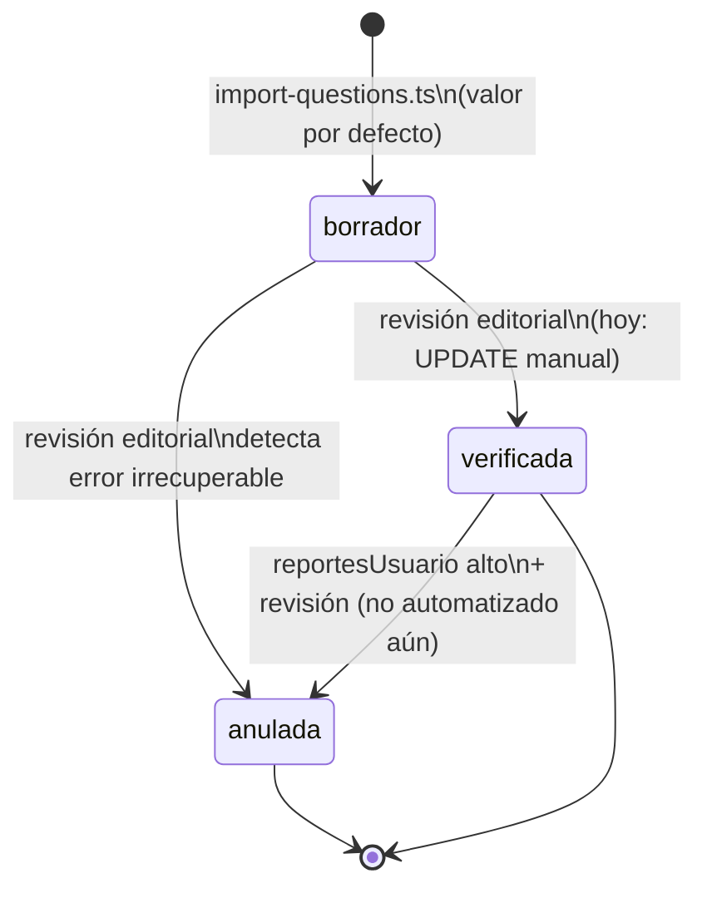

# Flujo de `estado` en `Pregunta`: borrador / verificada / anulada

Este documento explica qué significa cada valor de `Pregunta.estado`, dónde
se aplica en el código, y qué comportamiento queda **fijado por tests** en
`backend/src/routes/__tests__/estado-preguntas.test.ts`. Si cambias alguna
de estas reglas, actualiza también ese test (y esta tabla).

## Los tres estados

| Estado       | Significado                                                                 | ¿Quién los crea hoy? |
|--------------|------------------------------------------------------------------------------|------------------------|
| `borrador`   | Pregunta importada pero **sin revisión editorial**. Puede tener errores de redacción, respuesta dudosa, etc. Es el estado por defecto al importar (356 de las 414 preguntas del dataset inicial). | `import-questions.ts` |
| `verificada` | Un revisor humano ha confirmado el enunciado, las opciones y la respuesta correcta. Es la única que se muestra a usuarios finales por defecto. | Hoy, actualización manual (ver "Cómo se promociona" más abajo) |
| `anulada`    | La pregunta es inválida (error irrecuperable, ambigua, o el examen oficial la anuló). `respuestaCorrecta` puede ser `null`. No debe mostrarse ni responderse nunca. | Revisión editorial, o importación de una pregunta ya marcada como anulada en el origen |

El campo `reportesUsuario` (contador) existe para que, en el futuro, un
número alto de reportes de usuarios dispare una revisión (posible
degradación de `verificada` a `borrador`, o a `anulada`), pero **ese flujo
automático todavía no está implementado** — ver "Lo que falta" al final.

## Dónde se aplica cada regla (tres puntos de control independientes)

El estado no es un único interruptor: hay **tres sitios distintos** en el
backend que deciden algo distinto en función de él. Es importante no
confundirlos:

### 1. Descubrimiento — `GET /api/preguntas/aleatorias`
`backend/src/routes/preguntas.ts:43-48` y `:62-69`

- Por defecto (`estado` no especificado) solo devuelve preguntas
  `verificada`.
- Se puede pedir explícitamente `?estado=borrador` (por ejemplo, para una
  futura herramienta interna de QA que quiera "practicar" con el pool
  pendiente de revisar).
- `?estado=anulada` está **rechazado por el schema de validación** (400):
  una pregunta anulada nunca es un valor de descubrimiento válido, ni
  siquiera para uso interno.

### 2. Respuesta — `POST /api/preguntas/:id/responder`
`backend/src/routes/preguntas.ts:100-104`

- Solo bloquea (`410 Gone`) si `estado === "anulada"` o si no tiene
  `respuestaCorrecta` (las anuladas del dataset no siempre tienen una).
- **`borrador` NO está bloqueado aquí.** Si el cliente conoce el `id` de
  una pregunta en borrador (porque la pidió con `?estado=borrador`, o
  porque ya estaba en su lista de "repasar hoy" antes de que la
  degradaran), puede responderla con normalidad y queda registrado el
  intento.
- Esto es intencional: `estado` controla **qué se ofrece por defecto**,
  no una barrera de permisos sobre preguntas ya conocidas. La barrera de
  verdad para el usuario final es que el frontend público nunca debe
  pedir ni recibir un `id` en borrador salvo que sea explícitamente una
  superficie interna/QA.

### 3. Repaso espaciado — `GET /api/progreso/hoy`
`backend/src/routes/progreso.ts:46`

- Las preguntas **nuevas** que se ofrecen para empezar a trackear con
  SM-2 se filtran con `estado: "verificada"` a fuego (sin parámetro que
  lo cambie).
- Las preguntas que ya estaban en `Progreso` (porque el usuario ya las
  respondió antes) siguen apareciendo en el repaso aunque su estado
  cambie después — el filtro por estado solo aplica a la selección de
  preguntas *nuevas*, nunca retira una pregunta del historial de
  repaso de alguien.

## Diagrama de transición



## Tabla resumen de comportamiento por estado

| Estado       | `GET /aleatorias` (por defecto) | `GET /aleatorias?estado=X` | `POST /:id/responder` | `GET /progreso/hoy` (nuevas) |
|--------------|:---:|:---:|:---:|:---:|
| `borrador`   | ❌ oculta | ✅ visible si se pide explícitamente | ✅ permitido | ❌ nunca se sugiere |
| `verificada` | ✅ visible | ✅ visible | ✅ permitido | ✅ se sugiere |
| `anulada`    | ❌ oculta | ❌ 400 (valor no aceptado) | ❌ 410 Gone | ❌ nunca se sugiere |

## Cómo se promociona una pregunta hoy (y qué falta)

**Hoy no existe un endpoint de moderación/admin.** La promoción
`borrador → verificada` (o la anulación de una pregunta) se hace
directamente sobre la fila, por ejemplo con Prisma Studio
(`npm run prisma:studio`) o una consulta SQL:

```sql
UPDATE "Pregunta"
SET estado = 'verificada', "fechaVerificacion" = now()
WHERE id = 'q0001';
```

El test `Transición borrador → verificada` en
`estado-preguntas.test.ts` reproduce exactamente este `UPDATE` directo y
comprueba que el cambio se refleja de inmediato en `/aleatorias` — eso
es lo que garantiza que, cuando se construya una herramienta de admin,
baste con hacer ese mismo `UPDATE` (vía un endpoint en lugar de SQL a
mano) para que todo lo demás funcione sin cambios.

Pendiente para una fase posterior (fuera del alcance de este esqueleto):

- Endpoint `PATCH /api/admin/preguntas/:id/estado` protegido por rol de
  editor.
- Flujo automático: `reportesUsuario >= N` → volver a `borrador` para
  re-revisión (o `anulada` directamente si el reporte es contundente).
- Exponer `estado` y `reportesUsuario` en un panel de administración.

## Tests

Suite: `backend/src/routes/__tests__/estado-preguntas.test.ts` (8 tests).
Usa una base de datos de test real (ver `backend/.env.test.example`), con
fixtures propias (`test-estado-*`) que no dependen del dataset importado,
así que son deterministas y no interfieren con datos reales.

```bash
cd backend
cp .env.test.example .env.test   # ajusta DATABASE_URL si tu Postgres no usa
                                  # las credenciales por defecto
npm test
```

`npm test` ejecuta `prisma migrate deploy` contra la base de test antes de
correr la suite (script `pretest`), así que basta con que la base exista
(vacía) y sea alcanzable.

Cobertura actual:

1. `/aleatorias` sin filtro solo devuelve `verificada`.
2. `/aleatorias?estado=borrador` sí devuelve la pregunta en borrador (y
   sigue sin exponer `respuestaCorrecta`).
3. `/aleatorias?estado=anulada` responde 400.
4. `/responder` sobre una pregunta `verificada` funciona y crea `Intento`.
5. `/responder` sobre una pregunta `anulada` responde 410 y no crea `Intento`.
6. `/responder` sobre una pregunta `borrador` **sí** funciona (comportamiento
   intencional, documentado arriba).
7. `/progreso/hoy` nunca sugiere como "nueva" una pregunta en borrador o anulada.
8. Promocionar una pregunta (`UPDATE` directo) la hace aparecer de inmediato
   en `/aleatorias`.
